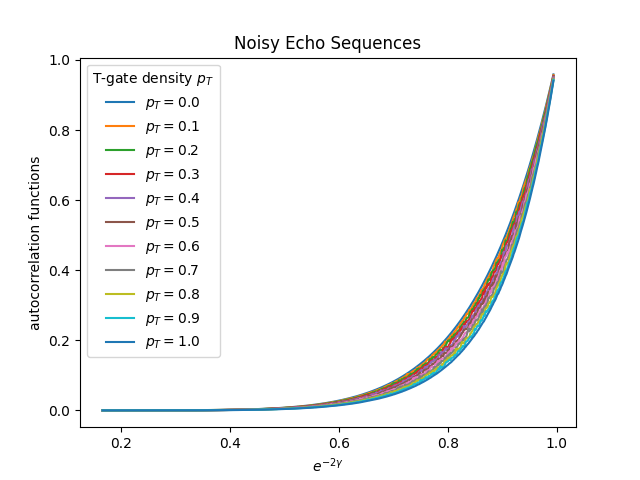
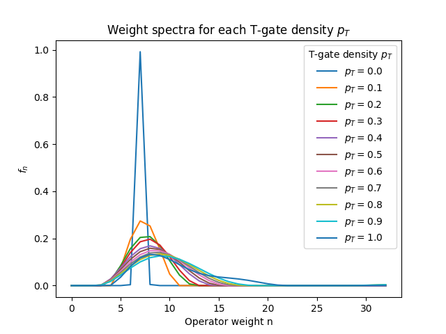
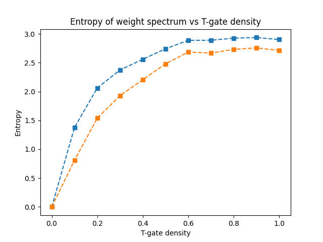

# 🔬 Noise-Based Operator Weight Spectroscopy (NBOWS)

A simulation framework for extracting operator-weight spectra from experimentally measurable noisy echo sequences.

This repository contains the classical simulation code for computing autocorrelation functions in noisy random Clifford circuits with tunable non-Clifford (T-gate) density. These autocorrelation profiles form the basis of a noise-resilient spectroscopy protocol for diagnosing operator growth and magic in quantum hardware.

---

# 🧠 Motivation

Understanding the growth of operator complexity (“magic”) in noisy quantum circuits is essential for:

- Benchmarking non-Clifford resources
- Diagnosing scrambling dynamics
- Identifying classical-to-quantum computational crossover regimes

Direct measurement of operator weight spectra on hardware is challenging.

NBOWS proposes an experimentally feasible alternative:

> Extract operator-weight spectra from noisy echo autocorrelation functions.

This approach avoids:
- Randomized measurements
- Multi-copy state preparation
- Full tomography

and is compatible with gate-based quantum processors.

---

# ⚙️ Model

We simulate noisy random Clifford circuits with stochastic T-gate insertion.

Key ingredients:

- Frozen random Clifford backbone
- Local Pauli kicks
- Tunable T-gate density \( p_T \)
- Deterministic depolarizing channel
- Averaging over magic realizations

The core simulation is implemented in:

```
noise-resilient_operator-weight_spectroscopy.py
```

The script computes the autocorrelation observable:

\[
C(\gamma) = \frac{1}{2^L} \mathrm{Tr}[P(\gamma)^2]
\]

as a function of effective noise strength.

---

# 📊 Example Results

## 1️⃣ Noisy Echo Autocorrelation Functions



Autocorrelation functions for different T-gate densities \( p_T \).

Observations:

- Increasing \( p_T \) modifies the curvature of the echo profile.
- Noise suppresses high-weight operator contributions.
- The observable is directly hardware-accessible.

These curves serve as the experimentally measurable input for operator-weight reconstruction.

---

## 2️⃣ Extracted Operator Weight Spectra



Operator weight distributions inferred from the autocorrelation data.

Key features:

- Pure Clifford circuits (\( p_T = 0 \)) produce sharply peaked spectra.
- Increasing \( p_T \) broadens the distribution.
- Higher operator weight correlates with stronger non-stabilizerness.

This demonstrates that magic growth manifests as systematic redistribution toward higher-weight sectors.

---

## 3️⃣ Entropy of the Weight Spectrum



Entropy of the extracted weight spectrum versus T-gate density.

- Entropy increases monotonically with \( p_T \).
- Indicates growth of operator complexity.
- Provides a quantitative proxy for magic under realistic noise.

Such behavior is directly relevant for benchmarking non-Clifford resources in symmetry-constrained and noisy quantum processors.

---

# 🏗 Technical Features

- Full Hilbert-space operator simulation in Python
- Frozen Clifford circuit sampling
- Monte Carlo averaging over magic realizations
- Deterministic depolarizing channel implementation
- NNLS-based spectral inversion framework
- Scalable structure compatible with HPC workflows

The current public release includes the autocorrelation simulation module. The full inversion and optimization pipeline is under active development.

---

# 🔎 Relevance to Quantum Hardware

Modern superconducting and trapped-ion platforms:

- Operate under noise
- Implement circuits with limited non-Clifford depth
- Require diagnostics beyond stabilizer benchmarks

NBOWS provides:

- A noise-aware diagnostic observable
- A scalable magic-growth proxy
- A bridge between theoretical operator growth and measurable hardware signals

This framework connects operator dynamics, noise, and experimentally accessible correlators in a unified benchmarking approach.

---

# 📌 Current Scope

This repository currently includes:

- Autocorrelation simulation code
- Representative spectral reconstruction results
- Entropy scaling analysis

Ongoing work includes:

- Variance scaling analysis
- Rényi entropy diagnostics
- Finite-size crossover behavior
- GPU acceleration
- Experimental implementation pathway

---

# 👤 Author

Rui-An (Ryan) Chang  
PhD Candidate in Quantum Information Science  
University of Texas at Austin  

Research focus: quantum many-body dynamics, operator growth, benchmarking, and quantum advantage.

---
